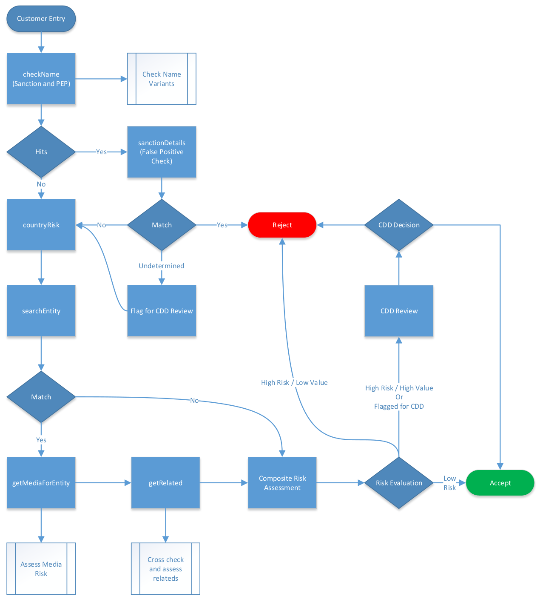

# Using the KYC3 API v2

A brief guide to the API functions, their specifications and how to incorporate them into prospecting, risk management and compliance processes.

COMMERCIAL CONFIDENTIAL

Version 2.02

# Using the KYC3 API

# Introduction

With the KYC3 API it is possible to automate much of the first line manual risk assessment work currently performed by KYC/CDD personnel.  The API provides several functions that when used properly and together can return detailed risk information regarding an individual, an organization or a location.  These results can be used to assess risk, automate onboarding and screening functions, reduce false positives and escalate risky cases for final assessment. Moreover, the API consists of functions to extract identity data from international travel documents containing a machine readable zone (MRZ) and face recognition functions to compare live selfies or small videos to the facial picture on official documents.

The API consists of several functions that work independently or can be tied into a full risk assessment process.  Calls are made via the RESTful interface and returns are in JSON format.  All transactions are handled over HTTPS.  HTTP is not supported.  

With the KYC3 API one can:

* Extract structured information from identity documents containing a MRZ (name, date of birth, sex, nationality, document number, expiration date)

* Extract the facial image from identity documents

* Compare the facial image from an identity document to a selfie or short video

* Verify that a short video is live

* Verify two factor spoken text in a live video

* Compare identity information against PEP (politically exposed persons) and Sanction lists

* Retrieve media articles based on identity information

* Retrieve company information based on identity information (person or company)

* Retrieve country risk scores for use in risk calculations

* Calculate a general risk score for an identified individual

# Authentication

We support two ways of user authentication:

1. Before sending requests to the API the user has to login with his regular KYC3.com credentials.
Then, he can use the retrieved authentication token in each request header 
"X-Auth-Token: <token>"

2. The user can send the API key as header with each request
"X-Api-Key: <api_key>"

# API Function Overview

**/auth (POST):** This function is used to start an authenticated session and retrieves an auth-token.

**/logout (GET):** This function is used to cancel an issued auth-token.

**/nameCheck (GET):** This function provides a quick and simple way to screen the name of an individual or company against all KYC3 sanctions and PEP (NOTE:  Politically Exposed Persons) lists.  The call accepts the search string, a full or partial set of name tokens, and returns a JSON structure containing the various sanction lists with hit counts.

**/entityDetails/sanction & /entityDetails/pep (GET):** These functions provide detailed sanction and PEP list information from the KYC3 intelligence database.  The call accepts the name search string and, when there is a name match on the list, this function will return the detailed entries that match.  All details provided by the relevant list are included, such as birthdate, nationality, residence location, known aliases and the nature of the sanction in question.

**/country/riskLookup (GET):** This function is used to retrieve country risk metrics for any given country code (ISO 3166 2 letter).  A general risk, plus specific corruption and AML risk metrics are provided.

**/entities/search (GET):** This function is used to search the KYC3 intelligence database for entities and returns a qualified set of entities matching the query.  This is the first step in accessing the KYC3 intelligence graph database as the resolved Entity ID is the required key to get additional information with other functions.

**/entities/related (GET):** This function is used to find the entities that are related to a specific entity.  The function returns a set of related entities (people, organizations and locations) known to KYC3.  This can be used to cross check relationships between people, organizations and locations.

**/media/byEntityId (GET):** This function is used to get the media, by topic, for any entity *by ID*.  The result set includes the main topics in which the entity is mentioned, the exposure in each topic and the top 25 media articles about the entity for each topic.

**/media/byEntityName (GET):** This function is used to get the media, by topic, for any entity *by Name, which may include multiple EntityIDs*, e.g. several "Steve Jobs" will each have their own EntityID.  The result set includes the main topics in which the entity is mentioned, the exposure in each topic and the top 25 media articles about the entity for each topic.

**/news/byEntityId (GET):** This function is used to retrieve the most recent media articles mentioning an entity, irrespective of the topic.  The result set includes a list of recent media articles containing references to the entity and, using the offset parameter, can be paginated to provide a "news browsing" UX.

**/media/byTopic (GET):** This function is used to retrieve the most recent media articles on a specific topic, irrespective of the entities mentioned therein.  The result set includes a list of recent media articles scoring highly on the specified topic and, using the offset parameter, can be paginated to provide a "news browsing" UX.

**/idCheck (POST):** This function validates:

1. The provided live selfie is genuine, meaning not manipulated, shows a human face and analyzes that the picture is taken from a true face and not from a still picture.

2. The provided passport is genuine, meaning not manipulated, has a valid MRZ, and contains the picture of a human face.

3. PEP/Sanction entries for the given name.

Moreover, the function:

1. reads the information from MRZ

2. compares the passport picture with the provided live selfie and determines if the faces mach.

**/identityValidator:** This function provides:

1. The provided live selfie is genuine, meaning not manipulated, shows a human face and analyzes that the picture is taken from a true face and not from a still picture.

2. The provided passport is genuine, meaning not manipulated, has a valid MRZ, and contains the picture of a human face.

Moreover, the function:

3. reads the information from MRZ

4. compares the passport picture with the provided live selfie and determines if the faces mach.

**/riskEval/eval (GET):** This function provides a risk value based on detailed sanction list information from the KYC3 intelligence database.  The call accepts the name search string. If the risk value is above a given threshold this function will return the detailed entries that match.  All details provided by the relevant list are included, such as birthdate, nationality, residence location, known aliases and the nature of the sanction in question. Moreover, the function provides a country risk metrics for any given country code (ISO 3166 2 letter).  A general risk, plus specific corruption and AML risk metrics are provided.

**/mrzExtractor (POST)**: This function reads the Machine Readable Zone from international Passports or ID-Cards and returns these values. The function accepts a jpeg or png picture of the front page and optional of the back page of an identification document. For Passports, the MRZ is expected to be on the front page and for ID-Cards on the back page.

**/faceRecognizer (POST)**: Provided a set of five selfie photos and an international Passport or ID-Card this function

1. checks if there is liveliness within the five selfies

2. all six faces (selfies + face from document) match.

**/videoRecognizer (POST)**: Provided a video, a picture of a travel document along with a proposed text (list of 5-10 randomly selected words) this function

1. checks from five frames that are randomly extracted from the video for liveliness

2. checks if the face from the five frames and the face from the id document match

3. performs a speech to text recognition on the spoken words

4. comares the recognized words to the list of provided words.

**/getWordList (GET)**: Provided a number between 1 and 10, the function returns a list of random words from the NATO alphabet. This list can be used in combination with the videoRecognizer to verify liveliness.

# Example Usage

All functions are accessible at the root URL: 

https://api.kyc3.com/v2/

An example call of the nameCheck function would be:

https://api.kyc3.com/v2/nameCheck?search_query=Sepp%20Blatter

curl -H "X-Api-Key: <api_key>" https://api.kyc3.com/v2/nameCheck?search_query=Sepp%20Blatter

curl -H "X-Auth-Token: <auth_token>" https://api.kyc3.com/v2/nameCheck?search_query=Sepp%20Blatter

*The above examples would call the nameCheck function for Sepp Blatter and return the sanction and PEP hits, if any for this name*

## Authentication

/auth 

*Authenticates the user with his KYC3.com credentials and returns an auth_token*

/logout

*Disables the auth_token*

## Sanction, PEP and AML/CFT risk

/nameCheck 

https://api.kyc3.com/v2/nameCheck?search_query=viktor%20bout 

/entityDetails/sanction 

https://api.kyc3.com/v2/entityDetails/sanction?search_query=viktor%20bout

/entityDetails/pep 

https://api.kyc3.com/v2/entityDetails/pep?search_query=viktor%20bout

/country/riskLookup 

https://api.kyc3.com/v2/country/riskLookup?iso_country_code=CH

Return notes: Score is 0 to 10 - lower is better. 

## Entity Search & Media

/entity/search

https://api.kyc3.com/v2/entity/search?search_query=sepp%20blatter

/entity/related 

https://api.kyc3.com/v2/entity/related?entity_id=PersonEntity:blattersepp

/media/byEntityId- Media by topic for entity with 25 articles per topic 

https://api.kyc3.com/v2/media/byEntityId?entity_id=PersonEntity:donaldtrump

/news/byEntityId - All news for an entity, from most recent paginated (50 per page) 

https://api.kyc3.com/v2/news/byEntityId?entity_id=PersonEntity:donaldtrump&offset_value=0

/media/byTopic – All news for a topic, from most recent paginated (50 per page) 

https://api.kyc3.com/v2/media/byTopic?topic_name=Crime:Terrorism&topic_strength=0.5&offset=0

## Call Parameter Explanations

For the media calls "offset_value" is the position from first search result in the set, i.e. 0 returns hits 1-50, 50 returns hits 51-100, etc.  

"topic_strength_value" is a value between 0 and 1, with higher values returning more focused results.  0 means no match to topic, 1 means perfect match with topic.  Recommended values for use are .3 to .7 depending on desired result. 

"topic_name_string" is as the attached reference and are returned with News/byEntity and media/byEntityId. 

# Detailed Function Specifications

## /auth (POST)

Authenticates the user with his KYC3.com credentials and returns an auth_token.

### Input (JSON)
~~~~
{ "username:<username>", “password:<password>” }
~~~~

### Output
~~~~
{	
	X-Auth-Token: <auth_token>
}
~~~~
## /logout (GET)

Disables the auth_token in the header.

## /nameCheck (GET)

Given a search term, this function will return a hit count array of sanction and PEP lists.  If there are no hits, then the search term does not appear on any of the available sanction or PEP lists.

### Input

search_query

### Output
~~~~
{
	"listings": [{
		"listName": "*listnamecode*",
		"listType": "*listtypestring*",		//sanction or pep
		"hits": *hitsnumber*,
		"uiSearchUrl": "*Api.kyc3.comResultURL*"
	}, { …}],
	"timestamp": *UnixTimeStampOfResponse*
}
~~~~
## /entityDetails/pep (GET)

## /entityDetails/sanction (GET)

Given a search term, these functions will return the relevant sanction details from the KYC3 system, if any. If more than 200 hits, the function will return the 200 most relevant pep or sanction entities to the search term. 

### Input

search_query

### Output
~~~~
{
Hits: hitcount
SanctionedEntities:[{
	"id": NodeNumberString,
	"entityType": EntityTypeString,
	"properties": {
		PropertyNameString: PropertyValueString,
		},
	"objectType": ObjectTypeString
	},
{…}] }
~~~~
### Property Tuples

**EntityID**

**EntityType**

**EntityName**

**SourceList**

**Name**			example: "Mohammed Muammar QADHAFI"

**FirstSeen**

**LastSeen 			**

**BirthDate			**

**Description**		example: "Date of UN designation: 17.3.2011. Son of Muammar QADHAFI."

**SanctionProgram**	example: "LBY"

**BirthPlace**		example: "Tripoli LBY"

**Gender			**

**AKA**			example: "[Mohammed Muammar KADDÁFÍ, Mohammed Moammer KADHAFI, Mohammed Muammar KADAFI, Mohammed Mouammar KADHAFI, Mohammed Muammar KADHAFI, Mohammed Muammar GHEDDAFI, Mohammed Muamar GADAFI, Mohammed Muammar GADDAFI, Mohammed Muammar GADDAFI]

**Address**

## /country/riskLookup (GET)

Given a 2 letter ISO country code as input the function will return the name and relevant risk metrics for the country.

### Input

iso_country_code 	// 2 letter ISO-3166-1 code

### Output
~~~~
{
    "isoCode": "ISOCountryCode",
    "isoName": "ISOCountryName",
    "totalRisk": KYCRiskValue,
    "mlRisk": AMLRiskValue,
    "corruptionRisk": CorruptionRiskValue
  }
~~~~
### Notes

Risk is a evaluated on a scale of 1 to 10 with 1 being the low risk and 10 being high risk.

Invalid or partial country codes will return an error.

Some countries may have no data – resulting in -1 return value.

## /entity/search (GET)

Given a search term this function will return the relevant Entities from the KYC3 system along with their attributes and relevance. The function will return the 200 most relevant entities to the search term. This return used to navigate the KYC3 graph and query the KYC3 document store.

### Input

search_query

### Output
~~~~
[{
	"id": NodeNumberString,
	"entityType": EntityTypeString,
	"properties": {
		PropertyNameString: PropertyValueString,
		…
		},
	"objectType": ObjectTypeString
},
{…}]
~~~~

#### Mandatory Property Tuples
~~~~
"entityId": EntityIDString
"entityType": EntityTypeString
"entityName": EntityNameString
"mentionCount": CountValue
~~~~
#### Facultative Property Tuples – new properties may be added
~~~~
"sanctioned": true/false
"gender": M, F or U (male, female or unknown)
~~~~
### Notes

EntityIDString is the relevant ID for further queries.

Currently allowed EntityTypeStrings are PersonEntity, LocationEntity and OrganizationEntity

**Usage:** When searching for relevant entities, it is best to refer to the mention-count value and to take the matching entity with the highest mention count value.  In cases where the search is not precise, there may be multiple entities with high values, in which case it may be worth calling the function with more specific search terms.

## /entities/related (GET)

Given an EntityID, return the related entities and their immediate properties, such as type and edgetype, in order to enable API based graph traversal.

### Input

EntityID

### Output

~~~~
{
"entityID": SoruceEntityIDString,
"sourceNode": SourceNodeNumberString,
"hits": NumberOfEntitiesInFollowingSet,
"relations":
	[{
	"id": NodeNumberString,
	"entityType": EntityTypeString,
	"properties": {
	PropertyNameString: PropertyValueString,
	…
	},
	"objectType": *ObjectTypeString*
	},
	{…}]
}
~~~~

### Mandatory Property Tuples
~~~~
"entityId": EntityIDString
"entityType": EntityTypeString
"entityName": EntityNameString
"mentionCount": CountValue
~~~~
### Facultative Property Tuples – new properties may be added
~~~~
"sanctioned": true/false
"gender": M, F or U (male, female or unknown)
~~~~
Note: Mention-Count will return -1 in the event that the count cannot be calculated.

## /media/byEntityId (GET)

### Purpose

Given an entity ID this function will return the relevant media exposure of the entity in the form of a set of Topics, MentionCounts within those topics and subsets of news article URLs for the top media articles per Topic.  In the initial implementation the top 25 topics, or less if there are not 25 topics in which the entity is exposed, will be returned along with mention counts and a subset of up to 20 news article URLs per topic.

This will be used to develop user experiences that show entities in context, specifically using the topics and mention counts to generate user interface components that enable the user to have an overview of the media exposure and to obtain detailed media coverage samples.

### Input

EntityID

### Output
~~~~
{
	"topics": [{
		"topicLabel": topiclabelstring,
		"count": mentioncount,
		"media": [{
			"headline": headlinestring,
			"publicationDate": UnixTime, 	
			"url": articleurl
		}, { …}],
	}, { … }]
}
~~~~
## /news/byEntityId (GET)

Given an EntityID this function will return the relevant media set of articles containing that entity.  The result set will include the sub-set of 50 headlines, publication date, topics and news article URLs, ordered from newest to oldest starting at the offset value.  The offset value permits for pagination.  

### Input

EntityID

OffsetValue

### Output

Results from the full set of results (ordered by publication date from newest to oldest) starting at the OffsetValue will be returned in the structure as follows:
~~~~
{
"hits": hitcount
	"media": [{
			"headline": headlinestring,
			"publicationDate": UnixTime, 	
			"PrimaryTopic": PrimaryTopicIDString,
			"PrimaryTopicStrength": PrimaryTopicIDValue,
			"SecondaryTopic": SecondaryTopicIDString,
			"SecondaryTopicStrength": SecondaryTopicIDValue,
			"TertiaryTopic": TertiaryTopicIDString,
			"PrimaryTopicStrength": TertiaryTopicIDValue,
	"url": articleurl
	}, { …}],
}
~~~~
### Note

The Primary, Secondary and Tertiary topics in the result are the *3 highest topic values* for the article.

## /media/byTopic (GET)

Given a Topic Description and the minimum TopicStrengthValue this function will return the relevant media set.  The result set will include the set of 50 headlines, publication date, and news article URLs, ordered from newest to oldest starting at the offset value.  The offset value permits for pagination.  

### Input

TopicNameString

TopicStrengthValue

OffsetValue

### Output

Results from the full set of results (ordered by publication date from newest to oldest) starting at the OffsetValue will be returned in the structure as follows:
~~~~
{
	"hits" : hitcount
	"media": [{
		"headline": headlinestring,
		"publicationDate": UnixTime,
		"url": articleurl
	}, { …}],
}
~~~~
## /riskEval/eval (POST)

Given a name and a country, this function will return a risk score as well as detail information on the sanction or PEP entries for the requested name. Furthermore, the function provides a general country risk score for the country of origin for the given person.

### Input as POST data

firstName

lastName

dob 	(Date of Birth as YYYY-mm-dd)

country (2 letter ISO code)

### Output
~~~~
{
	"riskScore": Int {0,1,2},
	"highestSanctionScore" : Int {0,1,2},
	"highestPepScore" : Int {0,1},
	"mediaRiskScore" : Double,
	"hitCount: Int,
	"listings": [{
		"listName": String,
		"listType": String,		//sanction or pep
		"hits": Int,
	}, { …}],
	"details" : [{
		"score" : Int {0,1,2},
		"names" : [String],
		"listName" : String,
		"listType" : String,
		"nationalities" : [String],
		"datesOfBirth" : [Date],
		"datesOfBirthOffset" : [Long]
	}, {…}],
	"countryRisk": {
    		"isoCode": String,
    		"isoName": String,
    		"totalRisk": *Double*,
    		"amlRisk": *Double*,
    		"corruptionRisk": *Double*
  	}
	"timestamp": UnixTimeStampOfResponse
}
~~~~
An example query is given as:
~~~~
curl 'https://api.kyc3.com/v2/riskEval/eval?fisrtName=Viktor&lastNameBout&cob=1970-01-13&country=RU’
~~~~
Date is always in the format: YYYY-mm-dd

Overall, Sanction and Pep score values have to be interpreted as:

* 0 → Green (ok)

* 1 → Yellow (warning)

* 2 → Red (reject)

The risk score is computed on the basis of the provided information and the retrieved results from Sanction, PEP and negative Media screening. The following steps are performed:

* Name matching is computed such that all partial hits in the request and in the lists for given names as well a as for last names will be treated as hits if there is at least one hit for given name and for last name.
All following tests will only be performed if the names match.

    * Check for Sanction entries

    * Check for PEP entries

    * Compare Date of Birth and Nationality to the ones returned by the sanction list and PEP list results. These comparisons will produce a score based on the following table.

<table>
  <tr>
    <td></td>
    <td>nationality</td>
    <td></td>
    <td></td>
  </tr>
  <tr>
    <td>

Date
Of
Birth</td>
    <td></td>
    <td>Not equal (0)</td>
    <td>Equal (1)</td>
  </tr>
  <tr>
    <td></td>
    <td>Equal</td>
    <td>Yellow (1)</td>
    <td>Red (2)</td>
  </tr>
  <tr>
    <td></td>
    <td>Switch month/day</td>
    <td>Yellow (1)</td>
    <td>Yellow (1)</td>
  </tr>
  <tr>
    <td></td>
    <td>Offset 1 ± 2 years</td>
    <td></td>
    <td>Yellow (1)</td>
  </tr>
  <tr>
    <td></td>
    <td>Offset 2 ± 6 month</td>
    <td>Yellow (1)</td>
    <td></td>
  </tr>
  <tr>
    <td></td>
    <td>Other</td>
    <td>Green (0)</td>
    <td>Green (0)</td>
  </tr>
</table>

* For the countryRisk:

amlRisk is based on Basel Institute for Governance, corruptionRisk is based on Transparency International and totalRisk is a hybrid based on the others plus UNODC and other sources.

Risk is a evaluated on a scale of 1 to 10 with 1 being the low risk and 10 being high risk.

Invalid or partial country codes will return an error.

Some countries may have no data – resulting in -1 return value.

* Media Risk Score

A Media Risk score will be computed by mention counts per topic and the sum of them under the risk profiles (AML or reputation risk).  These can be normalized as % of all mentions for the name and across topic total figures (all entity mentions for the subject). 

## /idCheck (POST)

Given a sequence of consecutive selfies that contain a movement of eyes or the mouth, together with a picture of a passport or two pictures of both sides of an id card, as welss as with a name, this function will return whether the live selfie is taken from a true human, the live selfie is genuine, the picture of the passport is genuine, contains a MRZ and a human face. Moreover, the function returns the MRZ information and a face recognition (match) result along with PEP/Sanction information on the provided name.

### Input (as POST multipart-form)

file1 ( path to file for upload )

file2 ( path to file for upload )

file3 ( path to file for upload )

file4 ( path to file for upload )

file5 ( path to file for upload )

passportFront ( path to file for upload )

passportBack ( path to file for upload )

search_query (name of the person to investigate)

### Output
~~~~
{
	"faceRec" : { “humanFace” : Boolean,
			"liveliness" : Boolean,
			"containsMRZ" : Boolean,
			"FaceMatch" : Boolean
			},
	"MRZ" : {
			"PassportType" : String,
			"IssuingCountry" : String,
			"Surname" : String,
			"GivenName" : String,
			"Sex" : Char(1) {M,F,?},
			"PassportNumber" : String,
			"DateOfBirth" : Date,
			"DateOfExpiration" : Date,
		}
	"pep" : {	Hits: hitcount
		SanctionedEntities:[{
			"id": NodeNumberString,
			"entityType": EntityTypeString,
			"properties": {
				PropertyNameString: PropertyValueString,
				},
			"objectType": ObjectTypeString
			},
		{…}] }
		}
	"sanction" : { 	Hits: hitcount
		SanctionedEntities:[{
			"id": NodeNumberString,
			"entityType": EntityTypeString,
			"properties": {
				PropertyNameString: PropertyValueString,
				},
			"objectType": ObjectTypeString
			},
		{…}] }
	}	
}
~~~~
An example is given as:
~~~~
curl -F "file1=@1.jpg" -F "file2=@2.jpg" -F "file3=@1.jpg" -F "file4=@1.jpg" -F "file5=@1.jpg" -F "passportFront=@passport.jpg" -F "search_query=Donald Trump"  https://api.kyc3.com/v2/identityValidator
~~~~
## /identityValidator (POST)

Given a sequence of consecutive selfies that contain a movement of eyes or the mouth, together with a picture of a passport or two pictures of both sides of an id card, this function will return whether the live selfie is taken from a true human, the live selfie is genuine, the picture of the passport is genuine, contains a MRZ and a human face. Moreover, the function returns the MRZ information and a face recognition (match) result.

### Input (as POST multipart-form)

file1 ( path to file for upload )

file2 ( path to file for upload )

file3 ( path to file for upload )

file4 ( path to file for upload )

file5 ( path to file for upload )

passportFront ( path to file for upload )

passportBack ( path to file for upload )

### Output
~~~~
{
	"humanFace" : Boolean,
	"selfieGenuity" : Boolean,
	"liveliness" : Boolean,
	"containsMRZ" : Boolean,
	"MRZ" : {
			"PassportType" : String,
			"IssuingCountry" : String,
			"Surname" : String,
			"GivenName" : String,
			"Sex" : Char(1) {M,F,?},
			"PassportNumber" : String,
			"DateOfBirth" : Date,
			"DateOfExpiration" : Date,
		}
	"FaceMatch" : Boolean
}
~~~~
An example query is given as:
~~~~
curl -F "file1=@1.jpg" -F "file2=@2.jpg" -F "file3=@1.jpg" -F "file4=@1.jpg" -F "file5=@1.jpg" -F "passportFront=@passport.jpg" https://api.kyc3.com/v2/identityValidator
~~~~
The function takes 6 to 7 input files depending on the kind of authorization document. For a passport one passport picture is sufficient because the picture and the MRZ are on the front page of the document. For ID cards the client has to provide pictures of both sides because the picture is on the front page whereas the MRZ is on the back page. Pictures have to have minimal depth of 400dpi and should be around 400x600 pixels in size for the selfies and around 1200x800 pixels for the passport pictures.

This function does sequential checking on the provided information as follows:

1. Check if there is one! Human face in each provided live picture file.
If one picture contains not exactly one human face the algorithm rejects the image.

2. Check if the provided pictures are genuine, meaning that they have not been altered or manipulated in the transit between the mobile application and the API.

3. Check provided live pictures for liveliness. This means to check for the change in some aspect ratios in special regions of a human face (eyes, mouth or chin).
If there is no motion in the facial region or a linear motion of all significant regions, indicating a still picture, the algorithm breaks.

4. Perform face recognition algorithm on all provided live selfies plus the detected face from the passport picture. If one of the pictures does not match the algorithm breaks.

5. Check if one of the provided pictures contains a MRZ, perform OCR on this region, compare with the checksum and provide all extracted information.

## /mrzExtractor (POST)

Given a picture of a passport or two pictures of both sides of an id card, this function will return the MRZ information and a face recognition (match) result.

### Input (as POST multipart-form)

passportFront ( path to file for upload )

passportBack ( path to file for upload )

### Output
~~~~
{
	"PassportType" : String,
	"IssuingCountry" : String,
	"Surname" : String,
	"GivenName" : String,
	"Sex" : Char(1) {M,F,?},
	"PassportNumber" : String,
	"DateOfBirth" : Date,
	"DateOfExpiration" : Date,
	"MRZCheck" : Boolean,
	"numberCheck" : Boolean,
	"dobCheck" : Boolean,
	"doeCheck" : Boolean
}
~~~~
## /faceRecognizer (POST)

Given a sequence of consecutive selfies that contain a movement of eyes or the mouth this function will return whether the live selfie is taken from a true human, the live selfie is genuine and the selfies show the face of the same person.

### Input (as POST multipart-form)

file1 ( path to file for upload )

file2 ( path to file for upload )

file3 ( path to file for upload )

file4 ( path to file for upload )

file5 ( path to file for upload )

passportFront ( path to file for upload )

passportBack ( path to file for upload )

### Output
~~~~
{
	"humanFace" : Boolean,
	"liveliness" : Boolean,
	"FaceMatch" : Boolean
}
~~~~
## /videoRecognizer (POST)

Given a video with a the audio of a proposed sequence of words, together with a picture of a passport or a picture of the front page of an id card, this function will return whether the video is taken from a true human, the live video is genuine and contains a human face. Also, this function returns a list of booleans, where the recognized words from video match the provided word list.

### Input (as POST multipart-form)

videoFile ( path to file for upload )

passportFront ( path to file for upload )

language (ISO country code)

wordList (Comma Separated String)

### Output
~~~~
{
	"faceRec" : {
	"humanFace" : Boolean,
		"liveliness" : Boolean,
		"FaceMatch" : Boolean
	}
	"wordMatch" : Boolean[]
}
~~~~
## /getWordList (GET)

Given a number of words between 1 and 10 the function returns a random list from the NATO alphabet.

### Input

### numberOfWords

### Output
~~~~
{
	[] : String[]
}
~~~~
# Sources

Today, KYC3 processes a large amount of public data in order to provide the intelligence capability that we deliver.  In addition to over 55,000 news and reputable industry blog sites that are monitored in near real-time, we also process all the major sanctions lists published by FATF member governments, public PEP lists and our own proprietary PEP lists.  

In addition to these "traditional" risk management sources, KYC3 also monitors a number of commercial registries in order to obtain company director, shareholder and location information.  The API can be used to obtain this information as well and can be a valuable tool in determining the locations of business relationships, the associates and the mandates related to an individual or company in the overall risk based KYC approach.  At the time of writing, the registries that are monitored include: US (Edgar), UK (partial), France, Belgium, Netherlands (partial), Switzerland (partial), and Luxembourg.

It is also possible to add additional sources to the system based on your requirements.  Adding news sources (URLs) is done at no charge for most requests.  If you wish to ensure that specific news sites are covered, please provide us a list of the URLs and we will either include them directly in the monitored content or revert to you with any concerns that we may have.  

# Putting it all Together

The API provides a granular and customizable facility to integrate KYC3 intelligence capabilities into any risk assessment or screening process.  Our aim is not to standardize your processes, but rather to provide a tool set that can be leveraged in order to gain efficiencies and competitive advantages in your current and future business process.  

We also provide assistance and advice on the use of the KYC3 API and have experience in delivering our capability across several use cases, including *prospect identification and qualification* systems, *customer and supplier risk monitoring* systems, *reputation risk management *systems and, of course, *classic KYC screening and compliance* systems.  

In order to understand how the various API functions can be used in concert, the following flowchart shows an example of the basic workings of the API as it would be implemented in a client on-boarding risk assessment process:

*Figure 1: Typical API flow for client onboarding*

# FAQs

1)	Do you provide fuzzy matching, e.g. Bin Laden vs. Bin Ludden?

No and this is by design.  We can do this very easily, but fuzzy hits will greatly increase the number of false positives.  We rather advocate making separate API calls so that you know which exact tokens cause the hit and can intelligently investigate.  With respect to false positives and other risks, getSanctionEntityDetails includes DOB and nationality matching in the results and getMediaForEntity can be used for extensive media exposure assessment by topic.

2)	Do you support any non-western character set languages? 

Yes, we are language agnostic and support extended char sets.  You can search for Chinese, Russian, Arabic and other names already.  If you would like specific content added to our system, please include this in your feedback.

3)	Do you provide a solution for ongoing screening? 

The API can be called in batch from your systems.  We can also provide custom solutions, such as SaaS based screeners or delivery of risk indexes via EDI to your systems.  Please contact us if you require a custom solution.

4)	What are the Sanction and PEP lists and how often are they updated?

The lists are per the JSON definition in the API spec.  All lists are updated daily.  News is near-real-time and is used for PEP and bad-guy identification, along with other public sources of PEP information.  Our PEP lists are proprietary.  There are approximately 4.2 million entities (people, organizations and addresses) tagged with sanction and PEP tags.

5)	By using your API, would you store any of our (client) screening-related data?

We do not store any of your data and we only log a minimum of information required for debugging.  We are engineered to minimize our risk of data breach and to keep your data confidential.  The best way for us to keep your data confidential is not to have it.  While we could offer a BPO screening solution and alert you on your customer and counter-party risk, this is not our architecture today.

# Reference: Topic Categories

<table>
  <tr>
    <td>Business:Agriculture</td>
  </tr>
  <tr>
    <td>Business:Alcohol and Marijuana</td>
  </tr>
  <tr>
    <td>Business:Apple</td>
  </tr>
  <tr>
    <td>Business:Automobiles</td>
  </tr>
  <tr>
    <td>Business:Aviation News</td>
  </tr>
  <tr>
    <td>Business:Bloomberg News</td>
  </tr>
  <tr>
    <td>Business:Brand Designs</td>
  </tr>
  <tr>
    <td>Business:Building Systems / Architecture</td>
  </tr>
  <tr>
    <td>Business:Challenges and Success</td>
  </tr>
  <tr>
    <td>Business:Cloud Service/Ent. Networks</td>
  </tr>
  <tr>
    <td>Business:Commerce</td>
  </tr>
  <tr>
    <td>Business:Company Events</td>
  </tr>
  <tr>
    <td>Business:Company Leaders</td>
  </tr>
  <tr>
    <td>Business:Conferences</td>
  </tr>
  <tr>
    <td>Business:Content and Advertising</td>
  </tr>
  <tr>
    <td>Business:Corporate Announcements</td>
  </tr>
  <tr>
    <td>Business:Energy</td>
  </tr>
  <tr>
    <td>Business:Growth and Trimming</td>
  </tr>
  <tr>
    <td>Business:Healthcare</td>
  </tr>
  <tr>
    <td>Business:Hospitality</td>
  </tr>
  <tr>
    <td>Business:Information Technology</td>
  </tr>
  <tr>
    <td>Business:Insurance</td>
  </tr>
  <tr>
    <td>Business:IT Infrastructures</td>
  </tr>
  <tr>
    <td>Business:Major Deals</td>
  </tr>
  <tr>
    <td>Business:Management Solutions</td>
  </tr>
  <tr>
    <td>Business:Maritime News</td>
  </tr>
  <tr>
    <td>Business:Net Neutrality</td>
  </tr>
  <tr>
    <td>Business:Oil & Gas</td>
  </tr>
  <tr>
    <td>Business:Online Retail</td>
  </tr>
  <tr>
    <td>Business:Pharmaceutical</td>
  </tr>
  <tr>
    <td>Business:Polls / Surveys</td>
  </tr>
  <tr>
    <td>Business:Printing and Packaging</td>
  </tr>
  <tr>
    <td>Business:Publishing</td>
  </tr>
  <tr>
    <td>Business:Restaurants / Retail</td>
  </tr>
  <tr>
    <td>Business:Smart Devices</td>
  </tr>
  <tr>
    <td>Business:Taxis and Transport</td>
  </tr>
  <tr>
    <td>Business:Technology</td>
  </tr>
  <tr>
    <td>Business:Telecoms / Broadband</td>
  </tr>
  <tr>
    <td>Business:Tobacco / Smoking</td>
  </tr>
  <tr>
    <td>Business:Tourism</td>
  </tr>
  <tr>
    <td>Business:Transportation</td>
  </tr>
  <tr>
    <td>Crime:Abuse</td>
  </tr>
  <tr>
    <td>Crime:Arrests</td>
  </tr>
  <tr>
    <td>Crime:Assaults</td>
  </tr>
  <tr>
    <td>Crime:Banking</td>
  </tr>
  <tr>
    <td>Crime:Convictions</td>
  </tr>
  <tr>
    <td>Crime:Corruption</td>
  </tr>
  <tr>
    <td>Crime:Death Penalty</td>
  </tr>
  <tr>
    <td>Crime:Drugs</td>
  </tr>
  <tr>
    <td>Crime:Extradition</td>
  </tr>
  <tr>
    <td>Crime:Family Crime</td>
  </tr>
  <tr>
    <td>Crime:General</td>
  </tr>
  <tr>
    <td>Crime:Guns</td>
  </tr>
  <tr>
    <td>Crime:Hate Crimes</td>
  </tr>
  <tr>
    <td>Crime:Illegal Actions</td>
  </tr>
  <tr>
    <td>Crime:Incidents/Emergencies</td>
  </tr>
  <tr>
    <td>Crime:Investigations</td>
  </tr>
  <tr>
    <td>Crime:Investigations / Studies</td>
  </tr>
  <tr>
    <td>Crime:Legal / Regulatory Reform</td>
  </tr>
  <tr>
    <td>Crime:Missing Persons</td>
  </tr>
  <tr>
    <td>Crime:Murder</td>
  </tr>
  <tr>
    <td>Crime:Police</td>
  </tr>
  <tr>
    <td>Crime:Prisons</td>
  </tr>
  <tr>
    <td>Crime:Rape</td>
  </tr>
  <tr>
    <td>Crime:Social Cases</td>
  </tr>
  <tr>
    <td>Crime:Terrorism</td>
  </tr>
  <tr>
    <td>Crime:Thefts</td>
  </tr>
  <tr>
    <td>Crime:Trials</td>
  </tr>
  <tr>
    <td>Crime:Vehicular Crash</td>
  </tr>
  <tr>
    <td>Crime:Victims</td>
  </tr>
  <tr>
    <td>Crime:Violence</td>
  </tr>
  <tr>
    <td>Crime:War Crimes / Human Rights</td>
  </tr>
  <tr>
    <td>Economy:Development</td>
  </tr>
  <tr>
    <td>Economy:Digital Currency</td>
  </tr>
  <tr>
    <td>Economy:Housing</td>
  </tr>
  <tr>
    <td>Economy:Markets</td>
  </tr>
  <tr>
    <td>Economy:Trade</td>
  </tr>
  <tr>
    <td>Entertainment:British Broadcasting</td>
  </tr>
  <tr>
    <td>Entertainment:Celebrities</td>
  </tr>
  <tr>
    <td>Entertainment:Charts</td>
  </tr>
  <tr>
    <td>Entertainment:Civil Events</td>
  </tr>
  <tr>
    <td>Entertainment:Comics</td>
  </tr>
  <tr>
    <td>Entertainment:Doctors</td>
  </tr>
  <tr>
    <td>Entertainment:Events</td>
  </tr>
  <tr>
    <td>Entertainment:Festivals</td>
  </tr>
  <tr>
    <td>Entertainment:Film</td>
  </tr>
  <tr>
    <td>Entertainment:General</td>
  </tr>
  <tr>
    <td>Entertainment:Media & Games</td>
  </tr>
  <tr>
    <td>Entertainment:Music</td>
  </tr>
  <tr>
    <td>Entertainment:Shows</td>
  </tr>
  <tr>
    <td>Entertainment:Television</td>
  </tr>
  <tr>
    <td>Entertainment:Theatre / Film</td>
  </tr>
  <tr>
    <td>Entertainment:Video Games</td>
  </tr>
  <tr>
    <td>Finance:Agriculture Markets</td>
  </tr>
  <tr>
    <td>Finance:Banking</td>
  </tr>
  <tr>
    <td>Finance:Chat Rooms</td>
  </tr>
  <tr>
    <td>Finance:Commodities Markets</td>
  </tr>
  <tr>
    <td>Finance:Company Announcements</td>
  </tr>
  <tr>
    <td>Finance:Company Financials</td>
  </tr>
  <tr>
    <td>Finance:Earnings Reports</td>
  </tr>
  <tr>
    <td>Finance:Economic Stimulus</td>
  </tr>
  <tr>
    <td>Finance:Economy</td>
  </tr>
  <tr>
    <td>Finance:Financial Analysis</td>
  </tr>
  <tr>
    <td>Finance:Financial Services</td>
  </tr>
  <tr>
    <td>Finance:High Net Worth</td>
  </tr>
  <tr>
    <td>Finance:Housing Markets</td>
  </tr>
  <tr>
    <td>Finance:Indian Markets</td>
  </tr>
  <tr>
    <td>Finance:Investment Funds</td>
  </tr>
  <tr>
    <td>Finance:Investor Announcements</td>
  </tr>
  <tr>
    <td>Finance:Legal News</td>
  </tr>
  <tr>
    <td>Finance:Market Research</td>
  </tr>
  <tr>
    <td>Finance:Market Studies / Outlook</td>
  </tr>
  <tr>
    <td>Finance:Personal Finance</td>
  </tr>
  <tr>
    <td>Finance:Property Markets</td>
  </tr>
  <tr>
    <td>Finance:Public Markets</td>
  </tr>
  <tr>
    <td>Finance:Ratings Agencies</td>
  </tr>
  <tr>
    <td>Finance:Statistics</td>
  </tr>
  <tr>
    <td>Finance:Stock Markets</td>
  </tr>
  <tr>
    <td>Finance:Taxes and Wages</td>
  </tr>
  <tr>
    <td>Finance:Taxes and Welfare</td>
  </tr>
  <tr>
    <td>Finance:Warnings/Downgrades</td>
  </tr>
  <tr>
    <td>Health :Cancer </td>
  </tr>
  <tr>
    <td>Health:Aging</td>
  </tr>
  <tr>
    <td>Health:Alcoholism</td>
  </tr>
  <tr>
    <td>Health:Blindness</td>
  </tr>
  <tr>
    <td>Health:Cancer</td>
  </tr>
  <tr>
    <td>Health:Care Services</td>
  </tr>
  <tr>
    <td>Health:Cell Research</td>
  </tr>
  <tr>
    <td>Health:Dental</td>
  </tr>
  <tr>
    <td>Health:Diseases</td>
  </tr>
  <tr>
    <td>Health:Foods and Ingredients</td>
  </tr>
  <tr>
    <td>Health:Illness and Care</td>
  </tr>
  <tr>
    <td>Health:Personal Grooming</td>
  </tr>
  <tr>
    <td>Health:Pharma/Biotech</td>
  </tr>
  <tr>
    <td>Health:Pharmacy</td>
  </tr>
  <tr>
    <td>Health:Procedures</td>
  </tr>
  <tr>
    <td>Health:Research  </td>
  </tr>
  <tr>
    <td>Health:Smoking</td>
  </tr>
  <tr>
    <td>Health:Studies</td>
  </tr>
  <tr>
    <td>Health:Viruses</td>
  </tr>
  <tr>
    <td>Health:Weight Loss</td>
  </tr>
  <tr>
    <td>Innovation:Biotech Research</td>
  </tr>
  <tr>
    <td>Innovation:Devices and Networks</td>
  </tr>
  <tr>
    <td>Innovation:Imaging</td>
  </tr>
  <tr>
    <td>Innovation:Measurements</td>
  </tr>
  <tr>
    <td>Innovation:Patents</td>
  </tr>
  <tr>
    <td>Innovation:Science</td>
  </tr>
  <tr>
    <td>Innovation:Semiconductor Devices</td>
  </tr>
  <tr>
    <td>National News:Arab News</td>
  </tr>
  <tr>
    <td>National News:Czech News</td>
  </tr>
  <tr>
    <td>National News:Dutch News</td>
  </tr>
  <tr>
    <td>National News:French News</td>
  </tr>
  <tr>
    <td>National News:German News</td>
  </tr>
  <tr>
    <td>National News:Goergian, Chinese, et al</td>
  </tr>
  <tr>
    <td>National News:Greek et al</td>
  </tr>
  <tr>
    <td>National News:Greek News</td>
  </tr>
  <tr>
    <td>National News:Indonesia</td>
  </tr>
  <tr>
    <td>National News:Italian News</td>
  </tr>
  <tr>
    <td>National News:Norwegian News</td>
  </tr>
  <tr>
    <td>National News:Portuguese News</td>
  </tr>
  <tr>
    <td>National News:Russian News</td>
  </tr>
  <tr>
    <td>National News:Russian, Hebrew and other non-Eng news</td>
  </tr>
  <tr>
    <td>National News:Spanish News</td>
  </tr>
  <tr>
    <td>National News:Vietnamese</td>
  </tr>
  <tr>
    <td>Natural Resources:Animals & Zoology</td>
  </tr>
  <tr>
    <td>Natural Resources:Climate Change</td>
  </tr>
  <tr>
    <td>Natural Resources:Fossil Fuels</td>
  </tr>
  <tr>
    <td>Natural Resources:Fracking</td>
  </tr>
  <tr>
    <td>Natural Resources:Metals and Minerals</td>
  </tr>
  <tr>
    <td>Natural Resources:Oil & Gas</td>
  </tr>
  <tr>
    <td>Natural Resources:Resources & Commodoties</td>
  </tr>
  <tr>
    <td>Natural Resources:Water</td>
  </tr>
  <tr>
    <td>Politics:Austrialian </td>
  </tr>
  <tr>
    <td>Politics:Baltic </td>
  </tr>
  <tr>
    <td>Politics:Brazilian </td>
  </tr>
  <tr>
    <td>Politics:Californian </td>
  </tr>
  <tr>
    <td>Politics:Canadian </td>
  </tr>
  <tr>
    <td>Politics:Central Asian </td>
  </tr>
  <tr>
    <td>Politics:Child Poverty / Welfare</td>
  </tr>
  <tr>
    <td>Politics:Chinese </td>
  </tr>
  <tr>
    <td>Politics:Community </td>
  </tr>
  <tr>
    <td>Politics:County / District </td>
  </tr>
  <tr>
    <td>Politics:Economic </td>
  </tr>
  <tr>
    <td>Politics:Elections</td>
  </tr>
  <tr>
    <td>Politics:European </td>
  </tr>
  <tr>
    <td>Politics:Football / Soccer</td>
  </tr>
  <tr>
    <td>Politics:Foundations</td>
  </tr>
  <tr>
    <td>Politics:Gay Marriage</td>
  </tr>
  <tr>
    <td>Politics:Gender Issues</td>
  </tr>
  <tr>
    <td>Politics:General</td>
  </tr>
  <tr>
    <td>Politics:Immigration </td>
  </tr>
  <tr>
    <td>Politics:Indian </td>
  </tr>
  <tr>
    <td>Politics:Intelligence and Security</td>
  </tr>
  <tr>
    <td>Politics:International Rights</td>
  </tr>
  <tr>
    <td>Politics:Iraqi </td>
  </tr>
  <tr>
    <td>Politics:Irish </td>
  </tr>
  <tr>
    <td>Politics:Israel / Palestine </td>
  </tr>
  <tr>
    <td>Politics:Japanese </td>
  </tr>
  <tr>
    <td>Politics:Jobs and Workers</td>
  </tr>
  <tr>
    <td>Politics:Kenyan </td>
  </tr>
  <tr>
    <td>Politics:Latin American </td>
  </tr>
  <tr>
    <td>Politics:Malaysian </td>
  </tr>
  <tr>
    <td>Politics:Maltese </td>
  </tr>
  <tr>
    <td>Politics:Military  </td>
  </tr>
  <tr>
    <td>Politics:Myanmar </td>
  </tr>
  <tr>
    <td>Politics:Nigerian </td>
  </tr>
  <tr>
    <td>Politics:North African </td>
  </tr>
  <tr>
    <td>Politics:Northern Ireland </td>
  </tr>
  <tr>
    <td>Politics:Pakistani </td>
  </tr>
  <tr>
    <td>Politics:Parking and Cambodia</td>
  </tr>
  <tr>
    <td>Politics:Party Elections</td>
  </tr>
  <tr>
    <td>Politics:Political Negotiations</td>
  </tr>
  <tr>
    <td>Politics:Privacy </td>
  </tr>
  <tr>
    <td>Politics:Regional Disputes</td>
  </tr>
  <tr>
    <td>Politics:Reports and Reviews</td>
  </tr>
  <tr>
    <td>Politics:Rights and Discrimination</td>
  </tr>
  <tr>
    <td>Politics:Royal Families</td>
  </tr>
  <tr>
    <td>Politics:Russian </td>
  </tr>
  <tr>
    <td>Politics:Scotland </td>
  </tr>
  <tr>
    <td>Politics:Singapore / Malaysia </td>
  </tr>
  <tr>
    <td>Politics:South East Asian </td>
  </tr>
  <tr>
    <td>Politics:State Affairs</td>
  </tr>
  <tr>
    <td>Politics:Strikes / Unions</td>
  </tr>
  <tr>
    <td>Politics:Taxes and Social Programs</td>
  </tr>
  <tr>
    <td>Politics:Thai </td>
  </tr>
  <tr>
    <td>Politics:Turkish </td>
  </tr>
  <tr>
    <td>Politics:UAE </td>
  </tr>
  <tr>
    <td>Politics:Ukrainian </td>
  </tr>
  <tr>
    <td>Politics:United Kingdom </td>
  </tr>
  <tr>
    <td>Politics:United Nations</td>
  </tr>
  <tr>
    <td>Politics:United States </td>
  </tr>
  <tr>
    <td>Politics:Unrest / Struggles</td>
  </tr>
  <tr>
    <td>Politics:US Foreign Relations</td>
  </tr>
  <tr>
    <td>Politics:US Military</td>
  </tr>
  <tr>
    <td>Politics:Veterans</td>
  </tr>
  <tr>
    <td>Politics:Vietnamese </td>
  </tr>
  <tr>
    <td>Politics:West African </td>
  </tr>
  <tr>
    <td>Politics:World Leaders</td>
  </tr>
  <tr>
    <td>Religion:Catholocism</td>
  </tr>
  <tr>
    <td>Religion:Christianity</td>
  </tr>
  <tr>
    <td>Religion:Chruch Funding</td>
  </tr>
  <tr>
    <td>Religion:Fund Raising</td>
  </tr>
  <tr>
    <td>Religion:Funeral</td>
  </tr>
  <tr>
    <td>Risk Events:Air Disasters</td>
  </tr>
  <tr>
    <td>Risk Events:Disasters</td>
  </tr>
  <tr>
    <td>Risk Events:Extreme Weather</td>
  </tr>
  <tr>
    <td>Risk Events:Maritime Warnings</td>
  </tr>
  <tr>
    <td>Risk Events:Road Safety</td>
  </tr>
  <tr>
    <td>Risk Events:Storms and Weather</td>
  </tr>
  <tr>
    <td>Science:Human Science</td>
  </tr>
  <tr>
    <td>Science:Inventions</td>
  </tr>
  <tr>
    <td>Science:Languages and Learning</td>
  </tr>
  <tr>
    <td>Science:Research  </td>
  </tr>
  <tr>
    <td>Science:Space</td>
  </tr>
  <tr>
    <td>Society:Architecture / Homes</td>
  </tr>
  <tr>
    <td>Society:Arts and Humanities</td>
  </tr>
  <tr>
    <td>Society:Awards</td>
  </tr>
  <tr>
    <td>Society:Awards </td>
  </tr>
  <tr>
    <td>Society:Births</td>
  </tr>
  <tr>
    <td>Society:Charity</td>
  </tr>
  <tr>
    <td>Society:Complaints</td>
  </tr>
  <tr>
    <td>Society:Court News</td>
  </tr>
  <tr>
    <td>Society:Deaths</td>
  </tr>
  <tr>
    <td>Society:Divorce / Infidelity</td>
  </tr>
  <tr>
    <td>Society:Education</td>
  </tr>
  <tr>
    <td>Society:Education / Students</td>
  </tr>
  <tr>
    <td>Society:Education / Tests</td>
  </tr>
  <tr>
    <td>Society:Ethics</td>
  </tr>
  <tr>
    <td>Society:Family Affairs</td>
  </tr>
  <tr>
    <td>Society:Gambling</td>
  </tr>
  <tr>
    <td>Society:History</td>
  </tr>
  <tr>
    <td>Society:India & Pakistan</td>
  </tr>
  <tr>
    <td>Society:Judges</td>
  </tr>
  <tr>
    <td>Society:Lawsuits / Court Actions</td>
  </tr>
  <tr>
    <td>Society:Maritime News</td>
  </tr>
  <tr>
    <td>Society:Memorial</td>
  </tr>
  <tr>
    <td>Society:Nevada</td>
  </tr>
  <tr>
    <td>Society:Opinions</td>
  </tr>
  <tr>
    <td>Society:Paintings and Photographs</td>
  </tr>
  <tr>
    <td>Society:Parks and Markets</td>
  </tr>
  <tr>
    <td>Society:People</td>
  </tr>
  <tr>
    <td>Society:Pets</td>
  </tr>
  <tr>
    <td>Society:Pubs</td>
  </tr>
  <tr>
    <td>Society:Relationships</td>
  </tr>
  <tr>
    <td>Society:Remembrance / Memorial</td>
  </tr>
  <tr>
    <td>Society:Settlements</td>
  </tr>
  <tr>
    <td>Society:Traffic</td>
  </tr>
  <tr>
    <td>Society:Unfortunate British Events</td>
  </tr>
  <tr>
    <td>Sports:American Football</td>
  </tr>
  <tr>
    <td>Sports:Baseball</td>
  </tr>
  <tr>
    <td>Sports:Basketball</td>
  </tr>
  <tr>
    <td>Sports:Boxing</td>
  </tr>
  <tr>
    <td>Sports:College Sports </td>
  </tr>
  <tr>
    <td>Sports:Corruption</td>
  </tr>
  <tr>
    <td>Sports:Cricket</td>
  </tr>
  <tr>
    <td>Sports:Cycling</td>
  </tr>
  <tr>
    <td>Sports:Debuts and Victories</td>
  </tr>
  <tr>
    <td>Sports:Football / Soccer</td>
  </tr>
  <tr>
    <td>Sports:Games</td>
  </tr>
  <tr>
    <td>Sports:General</td>
  </tr>
  <tr>
    <td>Sports:Golf</td>
  </tr>
  <tr>
    <td>Sports:Hockey</td>
  </tr>
  <tr>
    <td>Sports:Horse Racing</td>
  </tr>
  <tr>
    <td>Sports:Motorsport</td>
  </tr>
  <tr>
    <td>Sports:Play-By-Play</td>
  </tr>
  <tr>
    <td>Sports:Races</td>
  </tr>
  <tr>
    <td>Sports:Rugby</td>
  </tr>
  <tr>
    <td>Sports:School Sports</td>
  </tr>
  <tr>
    <td>Sports:Tennis</td>
  </tr>
  <tr>
    <td>Sports:Tennis / Squash</td>
  </tr>
  <tr>
    <td>Sports:Track and Field</td>
  </tr>
  <tr>
    <td>Technology:Apache</td>
  </tr>
  <tr>
    <td>Technology:Audio/Video Devices</td>
  </tr>
  <tr>
    <td>Technology:Display and Vision Technology</td>
  </tr>
  <tr>
    <td>Technology:Information Security</td>
  </tr>
  <tr>
    <td>Technology:Mobile Applications</td>
  </tr>
  <tr>
    <td>Technology:Online Security</td>
  </tr>
  <tr>
    <td>Technology:Open Source</td>
  </tr>
  <tr>
    <td>Technology:Social Media</td>
  </tr>
  <tr>
    <td>Weather:Weather</td>
  </tr>
</table>

# Reference: Sanction and PEP List Display Name Map

The following JSON structure maps the source collection keys to their display names in KYC3:

[{"source":"usa_ofac_sdn", "displayName":"OFAC Specially Designated Nationals List"},  

{"source":"un_1988", "displayName":"United Nations 1988 Sanction List"},   

{"source":"un_1267", "displayName":"United Nations 1267 Sanction List"},  

{"source":"gbr_hmtreasury_sanctions", "displayName":"Her Majesty's Treasury Sanction List"},

{"source":"eu_sanctions", "displayName":"EU Global Sanction List"},  

{"source":"che_seco", "displayName":"SECO Sanction List"},

{"source":"cia_leaders", "displayName":"CIA Political Party Leadership"},

{"source":"cia_chiefs_of_state", "displayName":"CIA Chiefs of State and Cabinet Members"},

{"source":"intinterpol", "displayName":"Interpol Wanted List"},   

{"source":"ukgovfsa","displayName":"FCA Unauthorised Firms List"},

{"source":"govfbi", "displayName":"FBI Wanted List"},  

{"source":"orgafdb", "displayName":"African Development Bank Santions"},

{"source":"orgadblnadbg4", "displayName":"Asian Development Bank Sanctions"},  

{"source":"orgworldbankweb", "displayName":"World Bank List of Ineligible Individuals"},

{"source":"comebrd", "displayName":"EBRD Ineligible Entities"},

{"source":"orgiadb", "displayName":"Inter-American Development Bank Sanctions"},  

{"source":"govdea", "displayName":"Drug Enforcement Administration Wanted List"},  

{"source":"govuspispostalinspectors", "displayName":"US Postal Inspection Service"},

{"source":"govoccapps", "displayName":"OCC/OTS Enforcement Orders"},

{"source":"govdocbisecl", "displayName":"US Government Consolidated Screening"},

{"source":"wikidata", "displayName":"KYC3 Politically Exposed Persons List"},  

{"source":"usa_ofac_con", "displayName":"US Treasury Consolidated Sanctions"},  

{"source":"cncomchinadignitaries", "displayName":"KYC3 China PEP List"}]

